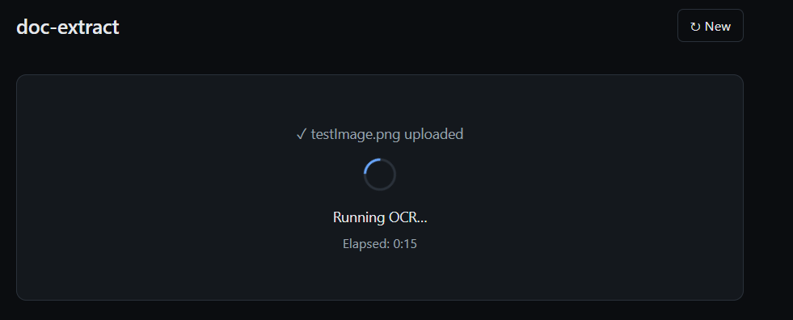
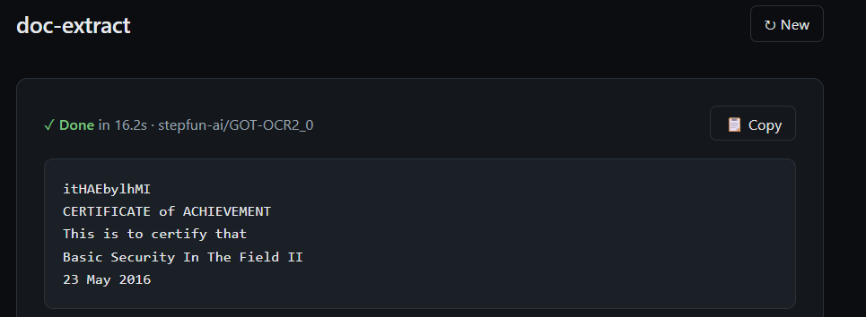

# doc-extract

A self-hosted REST microservice that extracts text from document images using a
local AI OCR model ([GOT-OCR 2.0](https://huggingface.co/stepfun-ai/GOT-OCR2_0)).
Comes with a minimal web UI for drag-and-drop uploads.

- No cloud calls, no per-page cost — the model runs locally.
- Two-container Docker stack: FastAPI backend + React/nginx frontend.
- Reusable as a pure REST API; the UI is optional.

**Status:** Early development. See [`docs/DESIGN.md`](docs/DESIGN.md) for the full
design and roadmap.

## Screenshots

Drop an image and wait while the model runs (indeterminate spinner + an
elapsed-time counter — see [docs/ARCHITECTURE.md](docs/ARCHITECTURE.md) for why
there's no progress bar):



When inference completes, you get the extracted text plus the model name and
wall-clock duration:



## Quick start

```bash
docker compose up --build
```

First build is slow — it pre-downloads ~1.5 GB of model weights into the API
image. Subsequent runs are fast.

Open <http://localhost:8080>, drop a document image, wait for the result.

## API

```bash
curl -F "file=@scan.png" http://localhost:8080/api/ocr
```

```json
{
  "text": "Extracted text from the document...",
  "duration_ms": 4521,
  "model": "GOT-OCR-2.0"
}
```

Full endpoint reference: <http://localhost:8080/api/docs> (FastAPI auto-generated).

## Performance

| Hardware                 | Per-page latency |
|--------------------------|------------------|
| Laptop CPU (8 cores)     | 10–30 s          |
| Server CPU (16+ cores)   | 5–15 s           |
| Modern GPU (CUDA)        | < 1 s            |

CPU-only is the default. GPU support is on the roadmap.

## Repository layout

```
doc-extract/
├── doc-extract-api/    # FastAPI + GOT-OCR (Python)
├── doc-extract-web/    # React + Vite + nginx
├── docs/
│   ├── ARCHITECTURE.md # why it's built this way
│   ├── DESIGN.md       # full design doc with alternatives
│   └── screenshots/    # UI screenshots used in this README
├── docker-compose.yml
├── README.md           # you are here
├── CLAUDE.md           # context for AI coding agents
└── CONTRIBUTING.md     # how to develop locally
```

## Further reading

- [docs/ARCHITECTURE.md](docs/ARCHITECTURE.md) — the *why* behind the technology choices.
- [CONTRIBUTING.md](CONTRIBUTING.md) — local dev workflow and conventions.
- [docs/DESIGN.md](docs/DESIGN.md) — full design document with alternatives considered.

## License

TBD — likely Apache 2.0 (matches the GOT-OCR 2.0 model license).
